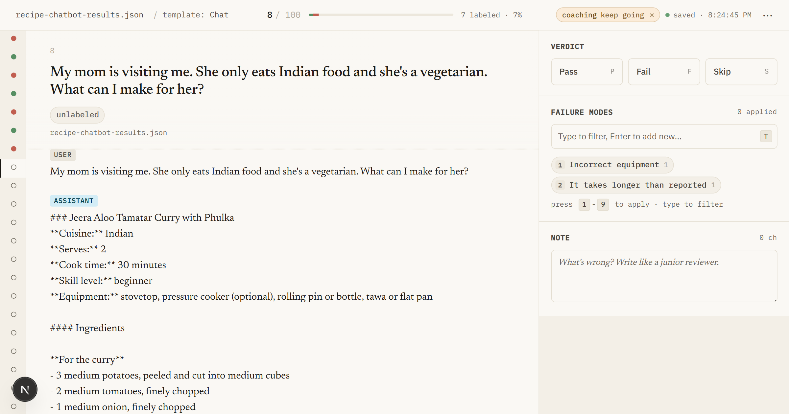
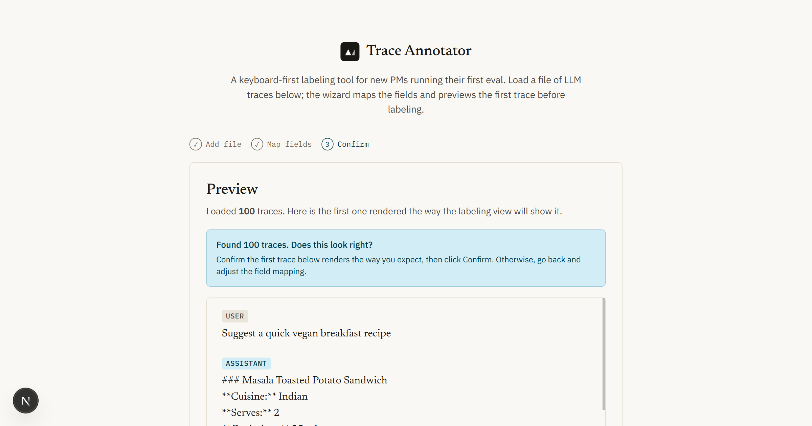
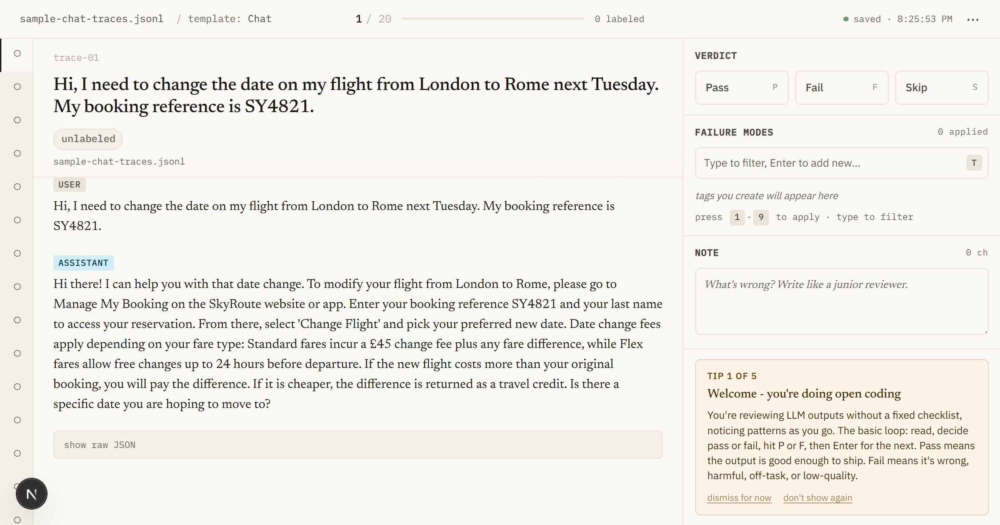
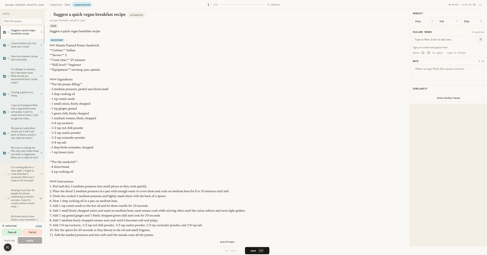

# Trace Annotator

A keyboard-driven local web app for reviewing LLM outputs and labeling what worked or failed. Built for PMs starting evals; grows with you when you're ready for power tools.



> From twenty traces an hour in a spreadsheet to more than two hundred. That number is not a guess. Hamel Husain reports the same multiplier from teams who built their own labeling tools: **"Teams with custom annotation tools iterate ~10x faster."**

<video src="public/screenshots/labeling-loop.mp4" controls width="800"></video>

## Why I built this

I recently completed [Hamel Husain and Shreya Shankar's *AI Evals for Engineers & PMs*](https://maven.com/parlance-labs/evals) course. The thing the course drives home is that doing evals well starts with looking at your own data, by hand, with intent. As Hamel puts it: **"Error analysis is the most important activity in evals."**

That is hard to do well in a spreadsheet. Every trace becomes a tiny rendering project, and by trace 30 you are tired and your tags drift. So I built the tool I wished existed while doing the course exercises. One that renders each trace the way the user actually saw it, lets me label with the keyboard, and surfaces the failure-mode tags I have already used so I do not reinvent them.

This repo is the result of three releases of doing exactly that.

## What it does

When you ship an LLM-powered feature, you have to look at lots of real outputs to spot the patterns of where it goes wrong. This kind of structured review is **open coding** (free-text notes on each example) followed by **error analysis** (finding the recurring patterns those notes reveal). Hamel describes the open-coding step as **"akin to 'journaling' and adapted from qualitative research methodologies."** Trace Annotator lets you do both without leaving the keyboard.

- **Load** your traces from JSONL, JSON, or CSV. The wizard auto-detects common shapes (`{traces: [...]}`, `{data: [...]}`, OpenAI-style `request/response` envelopes, JSONL) plus nested `messages[]` chats with `tool_calls`. If it cannot guess, it routes you to a manual mapping step.
- **Render** each trace the way the end user would see it (chat bubbles, email, tool-call cards) instead of raw JSON.
- **Label** Pass or Fail with one keystroke. Add free-text tags. Keys: `P` pass, `F` fail, `S` skip, arrows to navigate, `Cmd/Ctrl+Z` to undo.
- **Export** your labels as JSONL or CSV when you are done.



## Who this is for

PMs and domain experts running their first error-analysis pass. The course this tool grew out of is explicitly aimed at the same crowd ("AI Evals for Engineers & PMs"), and Hamel's framing for the role is: **"Empower domain experts to evaluate actual outcomes rather than technical implementation."** That is the audience this app is built around.

If you are an engineer and want a more programmable surface, flip the "I'm experienced" toggle in Settings. It exposes batch labeling, custom JSON adapters, tool-call review, and similarity highlighting. The beginner experience stays untouched.



## Designed for flow

A core finding from the course: **"You must remove all friction from the process of looking at data."** That is the design constraint behind every UX choice in this app:

- One keystroke per label, not click + dropdown + Save.
- The trace renders in its native format, so your brain does not waste cycles parsing JSON.
- Pass / Fail buttons and the tag suggestions sit in the same right-hand column, so the eye does not jump between surfaces after a verdict. The top 9 suggestions carry `1`-`9` hotkeys; one keypress applies.
- Progress and "minutes remaining" are always visible, so the session has a finish line.
- `Cmd/Ctrl+Z` undoes the last label. Reversibility is non-negotiable when you are forming a taxonomy on the fly.

Full design rationale in [docs/ux-research-note.md](./docs/ux-research-note.md).

## Lessons learned (with receipts)

Three releases shipped. Three lessons worth pulling forward:

- **Reviewers find more issues than you should fix.** A four-specialist review of v2.0 produced 42 findings. Triaging by *real-world impact for this user* (solo PM, local-only, learning) cut it to 5 actual fixes. Reviewers calibrate for enterprise ship gates; you have to apply your own filter.
- **Solve information architecture before placement.** When a UI question reads "where do these go?", check first whether a missing surface should be carrying them. Issue #55 started as "where do the displaced top-bar buttons go?" and converged on a kebab menu. Then `/explore` discovered the trace-list surface was missing entirely - adding it dissolved most of the placement question.
- **Run debates on plans, not just finished work.** Running `/ask-gpt` and `/ask-gemini` on the v3 plan (before building) caught four refinements that would have required rework later. Cheaper to fix a plan than to rewrite a shipped feature.

## Design decisions you can poke at

The judgment calls behind this tool are documented, not hand-waved. Each link below opens an artifact written before or during the work, not after.

- **Locked design decisions** (three-pane workspace, color tokens, hotkeys, density): the table in [CLAUDE.md](./CLAUDE.md).
- **Anti-patterns I deliberately rejected** (raw spreadsheet rows, "give me a labeling UI" prompts, hidden progress bars): [CLAUDE.md - Anti-patterns to actively reject](./CLAUDE.md).
- **What got cut from each release and why**: ["What was cut from v3 entirely"](./RELEASE-NOTES-v3.0.md#what-was-cut-from-v3-entirely) and v2.0's ["What's not in v2.0"](./RELEASE-NOTES-v2.0.md#whats-not-in-v20).
- **The "tool grows with the user" framing**: [v3 release notes](./RELEASE-NOTES-v3.0.md).

## What v3.0 includes

For everyone: the full v1/v2.x labeling loop (wizard, keyboard labeling, coaching arc, undo, tag management, autosave, JSONL/CSV export) and an "I'm experienced" toggle in Settings.

For experienced practitioners (after the toggle): batch labeling with one-click batch undo; a custom JSON adapter so the wizard skips its mapping step on saved file shapes; tool-call review (Right / Wrong / Skip per call, informational only); and similarity highlighting via TF-IDF + cosine.



Full v3.0 change list in [RELEASE-NOTES-v3.0.md](./RELEASE-NOTES-v3.0.md).

## What v3.1 / v3.2 add

**v3.1 (Quiet Notebook):** restyle to a warm-paper / muted-teal design system, with Newsreader serif for trace prose and a single consolidated tag input with `1`-`9` quick-apply hotkeys. Three new renderers (RAG, agent, summarizer). See [issue #53](https://github.com/mayankmankhand/Observability/issues/53).

**v3.2 (three-pane workspace):** the default workspace becomes a 220px queue rail (left) plus the trace pane (center) plus the 380px sticky decision rail (right). Multi-select for batch labeling moves into the queue (hover checkbox + shift-click range; contextual action bar at the bottom). The top bar slims to file/template/progress plus a single ⋯ overflow menu for Find, Tags, Export, Undo/Redo, Settings, and Jump to next unlabeled. The bottom bar shrinks to centered Prev / Next. Right-rail headers and helper text get a contrast bump. Queue collapses to a 40px icon strip below 1280px and into a slide-over drawer below 1024px. See [issue #55](https://github.com/mayankmankhand/Observability/issues/55).

## Install

The fastest path is to paste [AGENT-SETUP.md](./AGENT-SETUP.md) into Claude or ChatGPT and ask it to set the app up on your machine. Otherwise:

```bash
git clone https://github.com/mayankmankhand/Observability.git
cd Observability
npm install
npm run dev
```

Open `http://localhost:3000` and drop a file into the wizard. No file ready? Two synthetic fixtures ship with the repo:

- `fixtures/sample-chat-traces.jsonl` - 20 single-turn travel-assistant traces with deliberate failure modes. Good for a first session.
- `sample-data/recipe-chatbot-results.json` - 100 recipe-assistant traces. Larger dataset for sustained labeling.

## Bring your own data

Real trace data is never committed to this repo and is gitignored by default. Files are read in the browser; **nothing is uploaded anywhere**. Labels and session state live in your browser's IndexedDB. Full design in [docs/save-model.md](./docs/save-model.md).

## How this was built

Three releases, each shaped by an explicit explore -> plan -> execute -> review discipline. Each issue has a plan; each plan was debated by GPT and Gemini before execution; each release got a multi-specialist review pass. The commit history walks it forward issue by issue. The launch prep for this README also surfaced three real bugs ([#52](https://github.com/mayankmankhand/Observability/issues/52), [#58](https://github.com/mayankmankhand/Observability/issues/58), [#59](https://github.com/mayankmankhand/Observability/issues/59)). I would rather catch problems by trying to ship than by reading my own design notes.

## Roadmap

- **v3.3 candidates:** drawer dialog semantics (focus trap + `aria-modal`), kebab roving-tabindex / arrow-key navigation, `<main>` landmark on the trace pane, code-based custom adapter (write a TypeScript file in the repo instead of a JSON object), and SQLite storage backend if IndexedDB hits scale limits.
- **v4+:** open. Deliberately not building bridges to other eval platforms (Braintrust, LangSmith, Phoenix). The intent is "stay and grow inside Trace Annotator."

## License

MIT, see [LICENSE](LICENSE).
